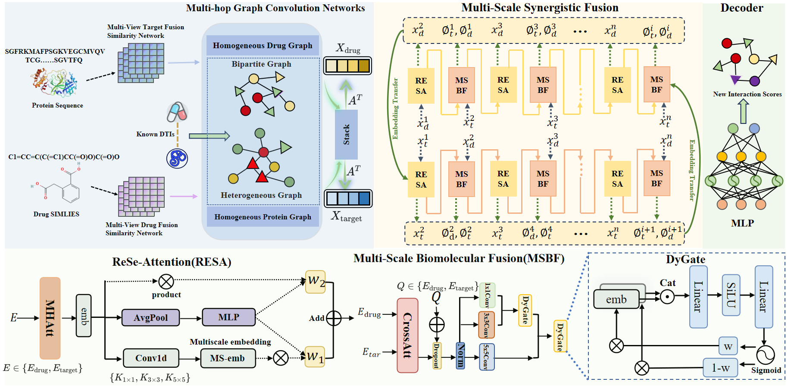

# **MSSFDTI: Drug-Target Interaction (DTI) Prediction**

## **Introduction**
Drug-target interaction (DTI) prediction is crucial for drug repositioning and multi-target therapies, especially for treating complex diseases. Recent advancements in graph representation learning have made significant progress in the field. However, current methods, based on nearest-neighbor aggregation of structural similarity, often fail to capture long-range synergistic effects across molecular substructures. Additionally, they tend to simplify or overlook the characterization of complex molecular interactions involving multiple binding types.

To overcome these limitations, we introduce **MSSFDTI**, a novel framework for DTI prediction. The model encodes drug and target representations via a **multi-hop graph neural network**, which incorporates an **adaptive weight learning mechanism**. This mechanism explicitly captures cross-order relationships between direct binding and indirect regulatory interactions, addressing the critical issue of insufficient long-range dependency modeling across molecular substructures.

Furthermore, the encoded features are processed through a **multi-scale deep interaction mechanism**, which simultaneously models both the local conformational match and global functional relevance of drug-target interactions. This approach significantly enhances the model’s ability to represent complex molecular interactions.

In extensive comparisons with six state-of-the-art methods, MSSFDTI demonstrates significantly superior performance on two widely used benchmark datasets. Additionally, case studies show that our method effectively identifies novel binding targets for multi-target drugs, offering valuable insights for DTI prediction.

## **Flowchart**

Here is a flowchart illustrating the overall process of the MSSFDTI framework:




## **Quick Start**

### **1. Set Up the Environment**
Before running the model, you need to set up your environment. We recommend using a **Python 3.8** virtual environment for better compatibility.

#### **Create a Virtual Environment (Optional but recommended)**
To create a new virtual environment using Python 3.8, run the following commands:

```bash
python3.8 -m venv mssfdtivenv  # Create a new virtual environment
source mssfdtivenv/bin/activate  # Activate the virtual environment (Linux/Mac)
```

For **Windows**, you can activate the environment using:

```bash
mssfdtivenv\Scripts\activate
```

#### **Install Required Dependencies**
Ensure you have **pip** installed, then install all required Python packages by running:

```bash
pip install -r requirements.txt  # Install dependencies from requirements.txt
```

If you don't have the `requirements.txt` file yet, you can generate it by following the instructions from the previous conversation.

### **2. Pre-training Phase**
Run the **pretraining** script to integrate drug similarity networks and target similarity networks. This step prepares the necessary features for the model.

```bash
python3 /path/to/MSSFDTI-main/src/pretrain_code/pretrain.py
```

Make sure to replace `/path/to/` with the actual directory path where the script is located.

### **3. Training Phase**
After pretraining, run the **training** script to train the model on the processed data.

```bash
python3 /path/to/MSSFDTI-main/src/train.py
```

This will start the training process for the DTI prediction model.

## **Contacts**
If you have any questions about the code or the algorithm, please feel free to reach out to:  
**Email**: wym0152@163.com

### **Note:**
- Ensure you have the required dependencies installed in your environment as listed in the `requirements.txt` file.
- You can install the required packages using `pip install -r requirements.txt`.
- You may need to install additional system-level dependencies depending on your environment (e.g., for GPU support or specific libraries).
